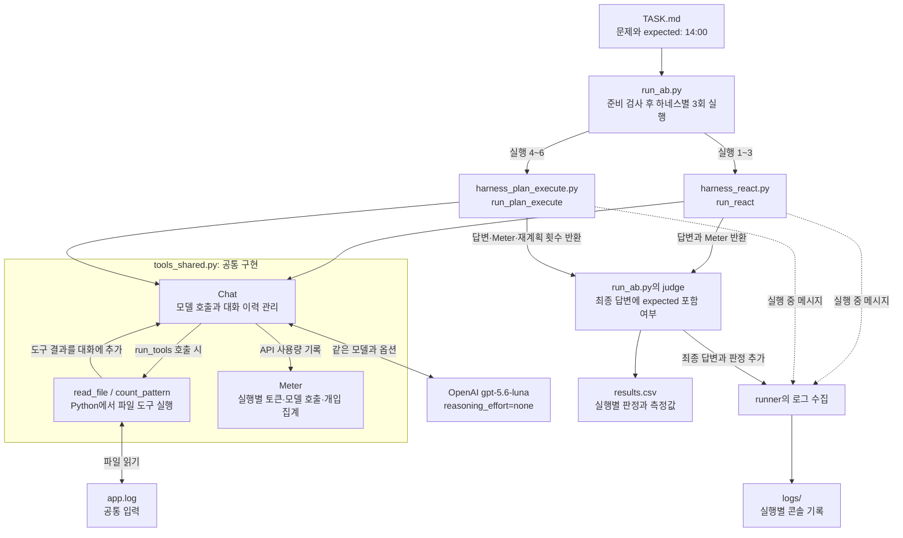
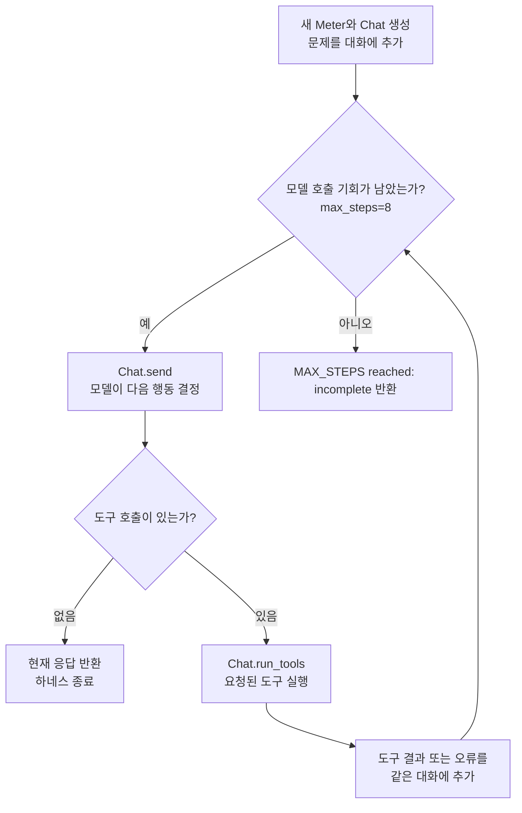
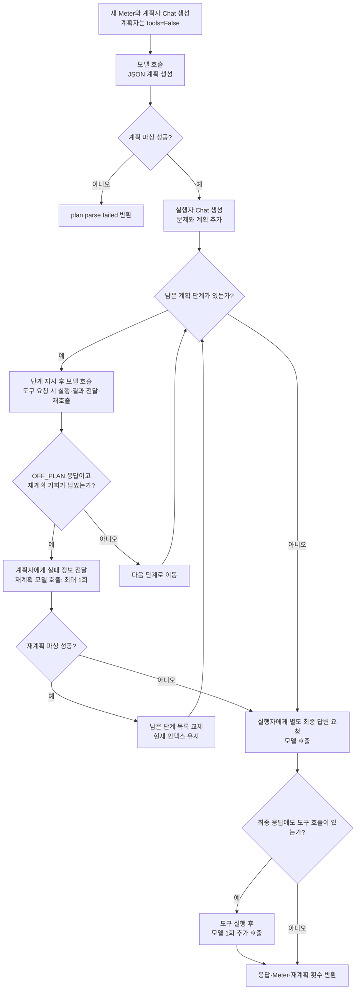

# Week 02 하네스 구조

이 문서는 이번 실험에 사용한 코드의 모듈 구성과 제어 흐름을 설명한다.
두 하네스 본문은 starter 그대로이며, 공통 연결 설정과 실행 전 준비 검사를 보완했다.
실행 설정은 [RUN_SETTINGS.md](RUN_SETTINGS.md), 측정과 해석은 [REPORT.md](REPORT.md)에 있다.

## 1. 전체 구성

[run_ab.py](run_ab.py)가 같은 태스크로 ReAct 3회, Plan-then-Execute 3회를 **순서대로** 실행한다.
아래 두 하네스로 나뉜 화살표는 호출 대상을 나타내며, 병렬 실행을 의미하지 않는다.
모델 호출과 도구 실행에는 양쪽 모두 [tools_shared.py](tools_shared.py)를 사용한다.

모델은 도구 이름과 인자를 요청하고, 실제 파일 처리는 하네스가 호출한 `Chat.run_tools()`에서 수행한다.
`read_file`은 처음 4,000자까지 반환하고, `count_pattern`은 정규식과 일치하는 줄 수를 반환한다.
두 도구의 예외는 오류 문자열로 바꾸어 대화에 추가한다.

각 실행마다 새 `Meter`를 만든다. Plan-then-Execute의 계획자와 실행자는 서로 다른 `Chat` 대화를
가지지만 같은 모델과 같은 `Meter` 인스턴스를 사용한다. `iters`는 모델 호출 횟수이며,
도구 호출 횟수나 계획 단계 수와 다르다. `--check`는 준비 검사 후 종료하므로 모델을 호출하지 않는다.

## 2. ReAct: 결과를 보고 다음 행동 결정

[run_react()](harness_react.py)는 하나의 대화에 문제·모델 응답·도구 결과를 누적한다.
모델 응답에 도구 호출이 없으면 그 응답을 반환한다. 반환된 답이 맞는지는 runner가 별도로 판정한다.

이번 설정의 `IRREVERSIBLE`은 빈 집합이므로 승인 요청이 없다. 실제 세 실행은 모두
첫 모델 호출에서 `read_file`을 요청하고, 두 번째 호출에서 `14:00`을 답하며 종료했다.
근거: [ReAct 실행 1](logs/react-01.txt), [실행 2](logs/react-02.txt), [실행 3](logs/react-03.txt).

## 3. Plan-then-Execute: 계획 생성 후 단계별 실행

[run_plan_execute()](harness_plan_execute.py)는 도구가 비활성화된 계획자에게 문자열 목록 형태의
JSON 계획을 받는다. 실행자는 별도 대화에서 그 계획의 각 단계를 수행하며 결과를 누적한다.
아래 도구 반복 노드는 한 단계 안에서 일어나는 도구 실행과 후속 모델 호출을 묶어 표시한다.

- 단계 내 도구 실행 후 모델을 다시 부를 때마다 `rounds`가 증가한다. `rounds >= 3`인데도
  추가 도구 요청이 있으면 그 요청을 처리한 뒤 `OFF_PLAN` 응답을 만들어 재계획 분기로 보낸다.
  `max_tool_rounds=3`은 하네스 전체 모델 호출을 3회로 제한한다는 뜻이 아니다.
- `OFF_PLAN`이어도 재계획 기회를 이미 썼으면 다음 단계로 이동한다.
  재계획 파싱 실패 시에는 단계 실행을 중단하고 최종 답변을 요청한다.
- 단계 응답에 `Answer:`가 나왔다는 이유만으로 조기 종료하지 않는다.
  계획 단계 처리가 끝나면 별도의 최종 답변 호출을 수행한다.

## 4. 실제 실험에서 모델 호출이 2회와 6회였던 이유

아래는 [ReAct 실행 1](logs/react-01.txt)과 [Plan-then-Execute 실행 4](logs/plan_exec-04.txt)를
코드의 `send()` 호출 위치와 대조한 것이다. 각 하네스의 다른 두 실행도 같은 호출 수를 보였다.

| 모델 호출 순번 | ReAct | Plan-then-Execute |
|---:|---|---|
| 1 | 파일 읽기 도구 요청 | 3단계 계획 생성 |
| 2 | 파일 내용을 보고 최종 답변, 종료 | 1단계: 파일 읽기 도구 요청 |
| 3 | — | 1단계: 도구 결과를 보고 단계 응답 |
| 4 | — | 2단계: 시간별 집계 응답 |
| 5 | — | 3단계: 정답 응답 |
| 6 | — | 계획 실행 후 별도 최종 답변 |

실제 `read_file` 함수 실행은 양쪽 모두 1회이고 `count_pattern`은 호출하지 않았다.
Plan-then-Execute의 재계획도 0회였다. 따라서 위 2회·6회는 이번 실행에서 관찰한 값이며,
모든 태스크에서 고정되는 호출 수가 아니다.

로그는 도구 출력의 처음 200자와 Plan-then-Execute 단계 응답의 처음 300자 등을 기록한다.
전체 API 대화 원문은 아니므로, 위 구조 설명은 로그와 실제 코드를 함께 근거로 삼았다.
